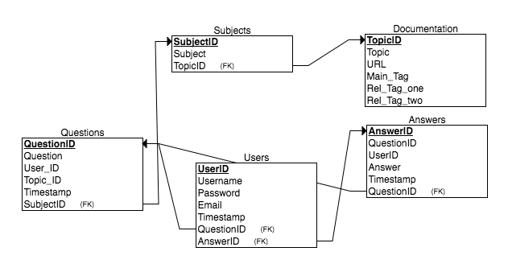

## ProjectOverflow

### Links

[Deployed API](https://project-overflow-db.herokuapp.com/)

[Database Repository](https://github.com/Dashy10/Project-Overflow-DB)

[Link to Deployed Application](https://project-overflow-feqhakhvfm.now.sh/)


## Overview

*  Project Overflow is the end all be all site for all questions, answers, and resources related to getting started and learning web development. The founders completed General Assembly's Web Development Immersive course with future students in mind, dealing with all hurdles and obstacles that are to be expected from young devs alike. Be an active or passive contributor as much as you wish. Enjoy!


## Wireframes

[Wireframes can be viewed on Trello](https://trello.com/c/pZPILXHR/3-wireframes)
## Pseudocode
**Home page** 

	 Build out nav bar to connect to all main pages 
	 	-About when clicked: Brings user to a more detailed page elaborating how to best use the site
	 	-Contact when clicked: Directs user to information page on the team of developers who built the site
	 	-Documentation when clicked: Directs the user to page of all relevant resources including links to the 3rd party pages
	 	-Searchbar when submitted: input entry will be caputured as Question and return relevant questions and answers regarding the topic
	 	-Account when clicked: Dropdown displayed to select the Profile option which will redirect user to the account page
	 	-Login when clicked: Will direct student to the login page to enter username and password credentials
	 
	 Components: About, Contact, Documentation, Searchbar, Account, Login, Title
	 	-Reusuable Components: Header + Footer
	 	
	 Add text Component for main page with How to instructions of site
	 
	 User enters a search query
	 	-Capture query string and store as Question data
	 		-Route to Questions page
	 			-Return connected answers to questions

**About page** 

	Consistent header and footer to connect to all main pages 
	
	Split the page into two divs: 
		-person A, looking for an answer 
		-person B, finding a question to answer
	
	Details for both on how to ask and answer the questions as well as using the site properly
		

**Contact page** 

	Consistent header and footer to connect to all main pages 
	
	Split the page into three divs holding each member of the team
	Each section will include an image of team member, information and links to connect with 

**Documentation page** 

	Consistent header and footer to connect to all main pages  
	
	Page will be sorted and broken up into different topics which will include all related links to that topic

**Searchbar page** 

	Consistent header and footer to connect to all main pages  
	
	Upon entering a search query, user will be redirected to a page containing all related questions to that topic (i.e search for 'Express' and frequently asked questions are populated
	
	Questions will be sorted by date, displaying the most recent
	
	Each question will be a link and can be clicked on to direct you to the page holding that questions along with every answer provided.
	
	Add a wrapper to this page so user can continually scroll down
	
	Comment box on the side promting the user again to ask a question if the results are not finding the answer

**Account page** 

	Consistent header and footer to connect to all main pages  
	
	Avatar of the user will be centered on the page
	
	Return all data related to the user:
		-username
		-date joined
		-email
		-password
		-questions asked
		-questions answered

**Login page** 

	Consistent header and footer to connect to all main pages 
	
	Text input type for email input
	
	Text input type for password input
	
	checkbox for remember me email input && password input
	
	Submit button that uses route to go to main page
	
	Signup button that opens modal;
	
	Modal will include:
	 -Text input type for email input
	 -Text input type for password input
	 - Text input type for username
	 - Submit button that will creat an account and move the user to the home page
	
	


## Project Timetable

| Component| Estimated Time |  Invested Time  | % Completed  | Actual Time |
|---|---|---|---|---|
| Psuedocode | 2.5 hours  |  1 hour  | 100%  | 1 hour  |
| Database Setup  | 3 hours  |  1 hour  | 100%  | 1 hour  |
| Express Application  | 1 hour  | 30 minutes  | 100% | 30 minutes  |
|React Application non-functional|3.5 hours|2 hours | 100% |2 Hours  |
|  React w/ functionality | 15 hours  |  25 hours | 80% | 20 hours |
|  Backend functionality | 6 hours  | 12 hours |  100% |  10 hours |
|  Design layout | 5 hours  | 8 hours | 90%  | 8 hours  |
|  Full deployment | 1 hour  | 30 min  | 100%| 30 min |
| Post MVP implementations  | 10 hours  | n/a | n/a | n/a |
| Total Project Timetable  | 57 hours  | 80 hours | 85% | 50 hours |

## Workflow
 
 Workflow can be viewed on our [Team Board](https://github.com/Dashy10/Project-Overflow#boards?repos=91987578)
	 
	 
## User Stories

* As a user, I want to be able to:
	*  search for all resources pertaining to the target subject
	*  see all the questions asked based on the subject searched
	*  ask questions based on the subject I searched
	*  see when a question was asked to show the relevance
	*  see answers based on the exact question that was asked
	*  see when an answer was given to show relevance
	*  see the documentation on how to ask and answer questions
	*  see when I have joined, what questions I have asked and what answers I have 	responded with
	* see the team that created the application and be able to connect with them
	* have easy access to log in and out of my account...or not at all
	 

## Database Structure



## Technologies
- HTML
- CSS
- JavaScript
- React.js
- Express.js
- Node.js
- Bootstrap
- postgreSQL
- Postico
- Postman
- Heroku
- NOW


## Code Example

```
renderIng(){
		let rendered = []
		if(this.state.finddata.data !== undefined) {
			let render = this.state.finddata.data.map((e) => {
				if (rendered.indexOf(e.question)) {
					console.log(e.question, rendered, rendered.indexOf(e.question))
					rendered.push(e.question)
					return (
						<div>
							<div> {e.question} </div>
							<div> {e.answer} </div>
						</div>
					);
				} else {
					console.log(e.question, rendered, rendered.indexOf(e.question))

					return (
						<div>{e.answer}</div>
					)
				}
			});
			return render;
		}
	}
```

## Contributing

This project was developed as part of the Web Development Immersive program at General Assembly in NYC, May 2017.

Instructors: Patrick Andre, Joe Keohan, Jon Zachary

TA's: Matt Kersner, Dominic Farquharson & Daniel Pease.


## Major Hurdles

We encountered a number of hurdles throughout this project and as a team we able to come together and solve majority of the problems. A few key hurdles to note:

*	Mapping through the questions and answers to render according to their assigned id. 
* On the database side, joining multiple tables 
* Cycling through each page and call to our API to render the correct data

## Future Improvements

There are still a number of things we would like to implement into our project, which are kept and updated on our project board. 

*  User login and authentication 
*  3rd party API to edit the text field to a code box
*  Up/Down vote functionality 
*  Continaully refactor code to be clear and concise
*  More to come...

## Author(s)

[Kyle Frable](kcfrable@gmail.com)

[Dashiell Lumas](https://github.com/Dashy10)

[Ed O'Connell](eoconnell44@gmail.com)


